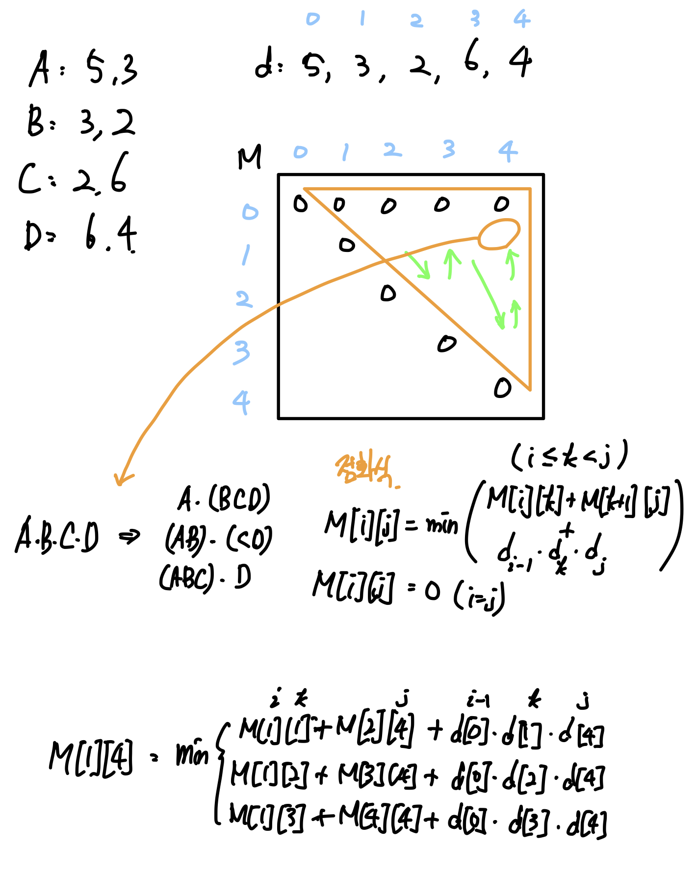

## 문제 링크

- [https://www.acmicpc.net/problem/11049](https://www.acmicpc.net/problem/11049)

## 문제 출처

- 백준

## 사용 알고리즘

- DP

## 풀이

<br/>


1. 행과 열에 대한 정보를 보관한다. (d 배열)
2. M[i][j] 를 i번 ~ j번 행렬의 최소 곱셈 연산 개수로 두고 점화식을 구성한다.
3. M[i][j] 는 대각선 순서로, 혹은 i의 역방향 순서로 구한다.

M[1][2] (AB) = M[1][1] + M[2][2] + d[0] * d[1] * d[2] = 0 + 0 + (5 * 3 * 2) = 30 <br/>
M[2][3] (BC) = M[2][2] + M[3][3] + d[1] * d[2] * d[3] = 0 + 0 + (3 * 2 * 6) = 36 <br/>

M[1][3] (ABC) => minimum( (A)BC , A(BC) )

(A)BC = M[1][1] + M[2][3] + d[0] * d[1] * d[3] <br/>
A(BC) = M[1][2] + M[3][3] + d[0] * d[2] * d[3] <br/>


n개의 행렬의 최소 곱셈 개수를 구하기 위해서는 n-1가지 경우의 수를 비교해야 한다.

<br/>

<details>
<summary>코드 보기</summary>

```C
#include <bits/stdc++.h>
using namespace std;
int main() {
  ios::sync_with_stdio(0);
  cin.tie(0);
  int n;
  cin >> n;
  vector<int> d(n + 1);
  vector<vector<int>> m(n + 1, vector<int>(n + 1, 0));
  for (int i = 0; i < n; i++)
    cin >> d[i] >> d[i + 1];

  for (int j = 1; j <= n; j++) {
    for (int i = j - 1; i > 0; i--) {
      int mn = INT_MAX;
      for (int k = i; k < j; k++)
        mn = min(mn, m[i][k] + m[k + 1][j] + (d[i - 1] * d[k] * d[j]));
      m[i][j] = mn;
    }
  }

  cout << m[1][n];
}
```

</details>

<br/>

```toc

```