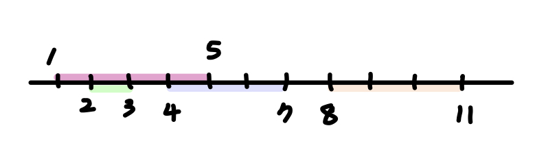

## 문제 링크

- [https://school.programmers.co.kr/learn/courses/30/lessons/42884](https://school.programmers.co.kr/learn/courses/30/lessons/42884)

## 문제 출처

- 프로그래머스 탐욕법 기본문제

## 사용 알고리즘

- 정렬, 그리디

## 풀이

<br/>

1. 카메라가 모든 고속도로를 커버해야 하기 때문에 이를 체크하기 위한 bool 배열을 선언한다.
2. 고속도로를 오름차순으로 정렬한 후, 먼저 오는 고속도로의 범위와 겹치는 고속도로들을 bool 배열에 체크한다. 겹치는 애들은 1개의 카메라로 커버할 수 있기 때문이다.
3. 겹치는 고속도로는 i번째 고속도로의 진출시점과 i+1, i+2, ...번 고속도로의 진입시점을 비교하여 체크한다.
4. [진입시점, 진출시점] 고속도로 데이터를 정렬하는 기준이 중요하다.
<br/>

> 진입시점을 기준으로 정렬할 경우 아래와 같은 케이스에서 최적의 답을 도출할 수 없다.
  

<br/>

<details>
<summary>코드 보기</summary>

```C
#include <bits/stdc++.h>
using namespace std;

int solution(vector<vector<int>> routes) {
    int answer = 0;
    int n = routes.size();
    vector<bool> used(n, 0);
    sort(routes.begin(), routes.end(), [](const vector<int> a, const vector<int> b) {
        return a[1] < b[1];
    });
    for(int i = 0; i < n; i++) {
        if(used[i]) continue;
        used[i] = 1;
        answer++;

        for(int j = i + 1; j < n; j++) {
            if(routes[i][1] < routes[j][0]) break;
            used[j] = 1;
        }

    }
    return answer;
}
```

</details>

<br/>

```toc

```
